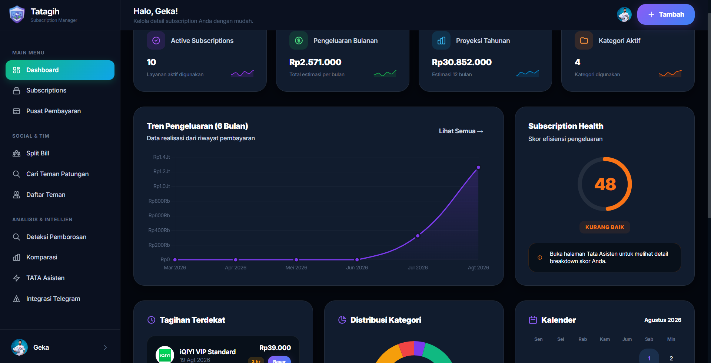
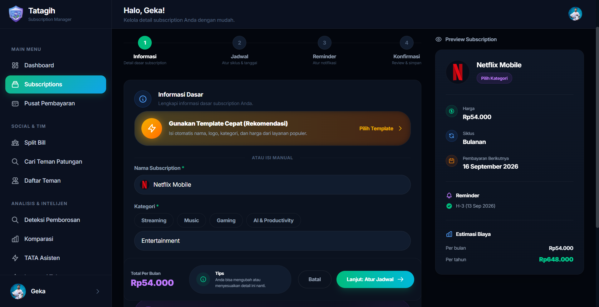
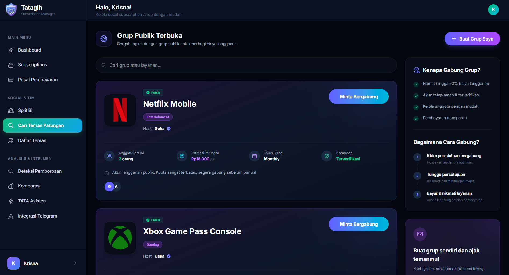
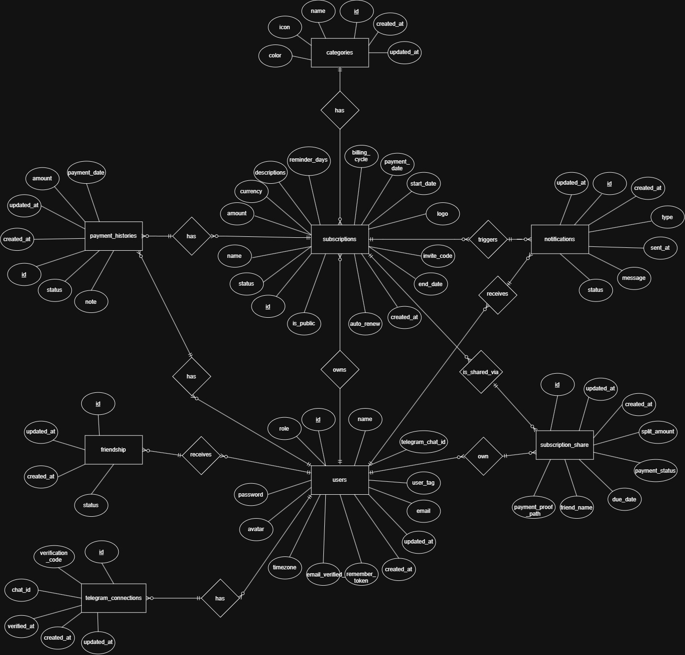

<div align="center">
  <h1>Tatagih</h1>
  <p><strong>Subscription Manager</strong></p>
  
  [](https://laravel.com)
  [](https://www.php.net/)
  [](https://tailwindcss.com/)
  [](https://www.mysql.com/)
</div>

<hr>

## Tentang Proyek
**Tatagih** adalah *Smart Subscription Manager* yang dilengkapi dengan Tata Asisten. Tatagih melacak tagihan langganan dan menganalisis kesehatan keuangan Anda kemudian mendeteksi pemborosan. Terdapat fitur sharing untuk manajemen patungan tagihan dengan teman dan mengirim notifikasi cerdas langsung ke Telegram Anda.


## Preview Aplikasi
Berikut adalah beberapa tangkapan layar dari antarmuka Tatagih:

<div align="center">
  
  
</div>
<div align="center">
  
</div>

## Fitur Unggulan

- **Patungan Tagihan**
  Berlangganan paket *Family* bersama teman? Fitur *Subscription Sharing* memungkinkan Anda untuk membagi tagihan dan melacak porsi bayaran masing-masing anggota.

- **Notifikasi Terintegrasi Telegram**
  Hubungkan akun Anda dengan bot Telegram. Dapatkan peringatan cerdas dan pengingat otomatis sebelum tenggat waktu pembayaran tiba, langsung ke aplikasi pesan Anda.

- **Pendeteksi Kebocoran Dana**
  Sistem yang otomatis mendeteksi:
  - *Overlapping Subscriptions*: Peringatan jika Anda berlangganan beberapa layanan dengan fungsi serupa (misal: memiliki Netflix, Disney+, dan HBO sekaligus).
  - *Vampire Spends*: Mendeteksi pengeluaran mikro bulanan yang tampak kecil, namun dikalkulasikan akan menguras dompet Anda secara masif dalam proyeksi 5 tahun ke depan.

- **Smart Templates & Plan Comparison**
  Tambah data langganan dalam hitungan detik menggunakan *Template* dari berbagai layanan populer. Gunakan juga fitur perbandingan (*Subscription Comparison*) untuk memilih varian paket berlangganan yang paling ekonomis sesuai kebutuhan Anda.

- **Tata Asisten**
  Dapatkan analisis mengenai profil pengeluaran Anda. Tata Asisten akan menghitung *Financial Health Score* Anda dan memberikan rekomendasi serta wawasan (*insights*) berbasis data mengenai kebiasaan berlangganan Anda.

- **Dashboard Analitik & Autentikasi Keamanan**
  Visualisasi data pengeluaran yang interaktif menggunakan Chart.js, dilengkapi dengan sistem registrasi, login, dan lupa kata sandi (*Reset Password*).

## Teknologi yang Digunakan
- **Backend:** Laravel (v13.x), PHP (v8.3+)
- **Frontend:** Tailwind CSS (v4.0), Vite, Blade Templates, Chart.js
- **Database:** MySQL
- **Integrasi API:** Telegram Bot API

## Struktur Database (ERD)
Berikut adalah visualisasi *Entity Relationship Diagram* dari aplikasi Tatagih. 
*Klik gambar di bawah untuk melihat*

[](./docs/ERD.jpg)


## Persyaratan Sistem
Sebelum menjalankan aplikasi ini, pastikan sistem Anda telah menginstal perangkat lunak berikut:
- **PHP** >= 8.3
- **Composer**
- **Node.js** & **NPM**
- **MySQL** atau MariaDB

## Panduan Instalasi
Ikuti langkah-langkah di bawah ini untuk menjalankan aplikasi di lingkungan pengembangan lokal:

### 1. Clone Repository
```bash
git clone https://github.com/ANTARTICA1/Subscription-Guard.git
cd Subscription-Guard
```

### 2. Install Dependensi PHP
```bash
composer install
```

### 3. Install Dependensi Frontend
```bash
npm install
npm run build
```

### 4. Konfigurasi Environment
Duplikat file `.env.example` menjadi `.env`:
```bash
cp .env.example .env
```
*(Di Windows, Anda bisa menggunakan `copy .env.example .env` pada Command Prompt)*

### 5. Generate Application Key
```bash
php artisan key:generate
```

### 6. Konfigurasi Database & Layanan Pihak Ketiga
Buat database baru di MySQL (misal: `tatagih_db`). Buka file `.env` dan sesuaikan kredensial database Anda:
```env
DB_CONNECTION=mysql
DB_HOST=127.0.0.1
DB_PORT=3306
DB_DATABASE=tatagih_db
DB_USERNAME=root
DB_PASSWORD=
```
*(Catatan: Anda juga dapat mengatur kredensial layanan Telegram Bot API pada file `.env` jika ingin menguji fitur bot notifikasi).*

### 7. Migrasi Database
Jalankan perintah berikut untuk membuat struktur tabel dan relasi kompleks (seperti *friendships* dan *shares*):
```bash
php artisan migrate --seed
```
*(Perintah `--seed` akan otomatis membuat akun default dan data contoh agar aplikasi tidak kosong saat pertama kali dijalankan).*

**Akun Default untuk Login (Hasil Seeding):**
- **User Biasa** *(Rekomendasi Utama)*: `user@tatagih.app` | Password: `password`
- **Admin** *(Hanya fitur pendukung)*: `admin@tatagih.app` | Password: `password`

### 8. Jalankan Aplikasi
Jalankan server lokal pengembangan Laravel:
```bash
php artisan serve
```

*Penting: Aplikasi ini menggunakan Job Scheduler dan Queue untuk fitur notifikasi otomatis ke Telegram dan pengiriman Email. Jika Anda ingin menguji fitur otomatis tersebut di lingkungan lokal, Anda **wajib** membuka 2 tab terminal baru dan menjalankan:*
1. `php artisan schedule:work` *(Untuk menghidupkan mesin pengingat otomatis)*
2. `php artisan queue:work` *(Untuk memproses antrean pesan yang akan dikirim)*

> [!CATATAN]
> **Catatan Telegram di Localhost:**
> Fitur **pengiriman notifikasi** ke telegram tetap berjalan normal di komputer lokal selama komputer terkoneksi ke internet. Namun jika ingin menguji fitur **Webhook** secara dua arah (menerima perintah balasan dari user ke Bot Telegram), Anda perlu menggunakan bantuan tunneling seperti [Ngrok](https://ngrok.com/) agar `localhost:8000` Anda mendapatkan URL publik yang bisa diakses oleh server Telegram.

---

## Catatan Khusus untuk Penilai

> [!CATATAN]  
> **Fokus Pengujian Aplikasi**  
> Fitur-fitur utama dari aplikasi ini (seperti Tata Asisten, Pendeteksi Kebocoran Dana, dan Patungan) berada pada **sisi Pengguna (User)**. Halaman Admin hanyalah fitur pendukung/dashboard ringkasan. **sangat disarankan untuk login menggunakan akun "User Biasa"** untuk melihat fungsionalitas utama aplikasi ini.

File `.env.example` disiapkan menggunakan pengaturan **Gmail SMTP**.
Jika Anda tidak ingin repot mengatur *App Password* Google untuk menguji aplikasi ini secara lokal, Anda dapat mengubah mode pengiriman email di file `.env` menjadi mode **log**:
```env
MAIL_MAILER=log
```
Sehingga link untuk simulasi *reset password* akan langsung dicetak dan dapat disalin dari file log lokal di:
`storage/logs/laravel.log`
